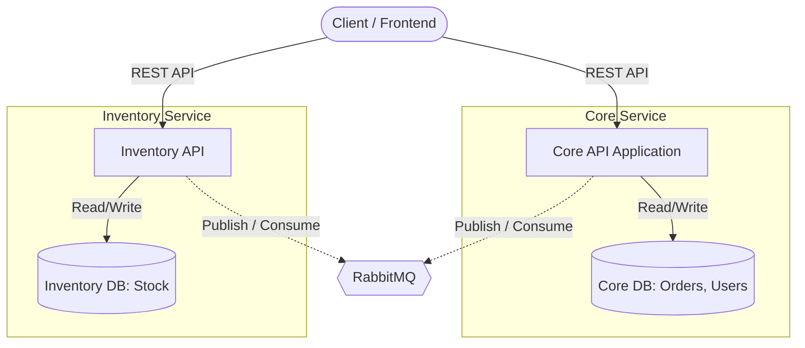
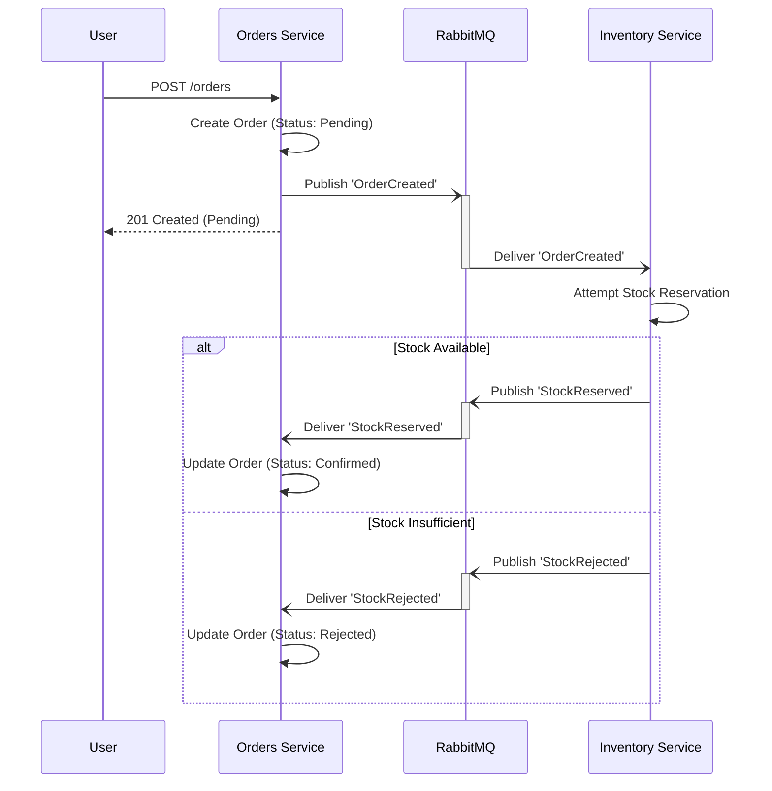
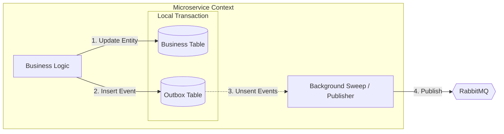

# 🛒 E-Commerce REST API - Microservices Architecture

A full-featured RESTful API for an e-commerce platform built with Node.js, Express, and Prisma. The system has recently evolved from a monolith into a **Microservices Architecture** leveraging the **Saga Pattern**, **RabbitMQ**, and the **Outbox Pattern** to ensure distributed data consistency.

**Base URL:** `http://localhost:3000/api` (Core API) / `http://localhost:3001/api` (Inventory API)

---

## 📋 Table of Contents

- [Architecture & Patterns](#-architecture--patterns)
- [Authentication](#-authentication)
- [Categories](#-categories)
- [Product Catalog](#-product-catalog)
- [Inventory](#-inventory)
- [Users](#-users)
- [Shopping Cart](#-shopping-cart)
- [Orders](#-orders)
- [Payments](#-payments)
- [Pricing & Discounts](#-pricing--discounts)
- [Error Handling](#-error-handling)
- [Roles & Permissions](#-roles--permissions)

---

## 🏗️ Architecture & Patterns

This project showcases several advanced, enterprise-grade ("senior level") design patterns to handle distributed systems reliably.

### 1. Microservices & Database per Service
The application is split into two primary services:
- **Core Service**: Handles Users, Product Catalog, Orders, and Payments.
- **Inventory Service**: Exclusively manages stock levels and reservations.

Each service has its own dedicated PostgreSQL database (`postgres` and `inventory-postgres`). We strictly avoid cross-database foreign keys or joins, forcing all cross-domain communication to happen via asynchronous events.



### 2. Event-Driven Communication (RabbitMQ)
Services communicate asynchronously using RabbitMQ. We use durable queues and topic exchanges to route domain events like `OrderCreated`, `StockReserved`, and `StockRejected`.

### 3. The Saga Pattern (Distributed Transactions)
To maintain data consistency across databases without using distributed locks or 2PC (Two-Phase Commit), we implement a Choreographed Saga for order creation:



### 4. Transactional Outbox Pattern
To prevent the "dual-write" problem (e.g., saving to the DB but crashing before publishing to RabbitMQ), services use the **Outbox Pattern**. Events are saved to an `outbox_events` table in the *same local database transaction* as the business entity changes. A background publisher reliably reads from the outbox and dispatches events to RabbitMQ.



### 5. Idempotent Consumers (Exactly-Once Semantics)
Because RabbitMQ guarantees *at-least-once* delivery, consumers must be idempotent to handle redeliveries safely. Every consumer checks a `processed_events` table within its transaction. If an event was already processed, it is skipped, ensuring side effects (like decrementing stock) only happen once per event.

---

## 🔐 Authentication

All protected endpoints require a **Bearer Token** in the `Authorization` header:

```
Authorization: Bearer <accessToken>
```

### POST `/auth/login`
Authenticates a user and returns an access token. Sets an HttpOnly `refreshToken` cookie.

**Request Body:**
```json
{
  "email": "user@example.com",
  "password": "password123"
}
```

**Response `200 OK`:**
```json
{
  "accessToken": "eyJhbGciOiJIUzI1NiIsInR5cCI6IkpXVCJ9..."
}
```

---

### POST `/auth/refresh`
Generates a new access token using the `refreshToken` cookie (valid for 7 days).

---

## 📂 Categories

| Method | Endpoint | Description | Roles |
|--------|----------|-------------|-------|
| `GET` | `/categories` | Get all categories | ADMIN, USER |
| `GET` | `/categories/:id` | Get category by ID | ADMIN, USER |
| `POST` | `/categories` | Create one or more categories | ADMIN |
| `PATCH` | `/categories/:id` | Update a category | ADMIN |
| `DELETE` | `/categories/:id` | Delete a category | ADMIN |

---

## 📦 Product Catalog

| Method | Endpoint | Description | Roles |
|--------|----------|-------------|-------|
| `GET` | `/catalog/` | Get all active products with variants | ADMIN, USER |
| `POST` | `/catalog/` | Create a new product | ADMIN, SUPPLIER |
| `PATCH` | `/catalog/:id` | Update a product and/or its variants | ADMIN, SUPPLIER |
| `DELETE` | `/catalog/:id` | Soft-delete a product | ADMIN, SUPPLIER |

Products support multiple variants (e.g., sizes/colors), each with their own SKU, pricing, images, and decoupled inventory references.

---

## 🏭 Inventory (Inventory Service)

| Method | Endpoint | Description | Roles |
|--------|----------|-------------|-------|
| `GET` | `/inventory/` | Get all inventory locations | ADMIN |
| `GET` | `/inventory/:id` | Get inventory by ID | ADMIN |
| `POST` | `/inventory/` | Create an inventory location | ADMIN |
| `PATCH` | `/inventory/:id` | Update an inventory location | ADMIN |
| `PATCH` | `/inventory/stock/:id` | Update stock level for a product variant | ADMIN, SUPPLIER |

*Note: Stock decrements during order creation are handled asynchronously via the Saga pattern, not through direct synchronous API calls.*

---

## 👤 Users

| Method | Endpoint | Description | Roles |
|--------|----------|-------------|-------|
| `POST` | `/users/` | Create a new user account | Public |
| `GET` | `/users/` | Get all users | ADMIN |
| `GET` | `/users/:id` | Get user by ID | ADMIN |
| `GET` | `/users/email/:email` | Get user by email | ADMIN |
| `PATCH` | `/users/:id` | Update user info | ADMIN, CUSTOMER |
| `DELETE` | `/users/:id` | Deactivate a user | ADMIN, CUSTOMER |

---

## 🛍️ Shopping Cart

Base path: `/users/:id/cart`

| Method | Endpoint | Description | Roles |
|--------|----------|-------------|-------|
| `GET` | `/users/:id/cart` | Get user's cart | ADMIN, CUSTOMER |
| `POST` | `/users/:id/cart/items` | Add item to cart | ADMIN, CUSTOMER |
| `PATCH` | `/users/:id/cart/items/:variantId` | Update item quantity | ADMIN, CUSTOMER |
| `DELETE` | `/users/:id/cart/items/:variantId` | Remove item from cart | ADMIN, CUSTOMER |
| `DELETE` | `/users/:id/cart` | Clear entire cart | ADMIN, CUSTOMER |

---

## 📋 Orders

| Method | Endpoint | Description | Roles |
|--------|----------|-------------|-------|
| `GET` | `/orders/` | Get all orders | ADMIN |
| `POST` | `/orders/` | Create a new order (Triggers Saga) | Authenticated |
| `GET` | `/orders/:orderId` | Get order by ID | Authenticated |
| `GET` | `/orders/user/:userId` | Get orders by user | Authenticated |
| `PATCH` | `/orders/:orderId/status` | Update order status | Authenticated |
| `DELETE` | `/orders/:orderId` | Soft-delete an order | Authenticated |

### Order Saga Statuses
`pending` → `confirmed` (or `stock_rejected`) → `packed` → `shipped` → `delivered` → `cancelled`

**Request Body (Create Order):**
```json
{
  "userId": "user-uuid",
  "items": [
    { "productVariantId": "variant-uuid-1", "quantity": 2, "unitPrice": 49.99 }
  ],
  "totalPrice": 99.98
}
```

---

## 💳 Payments

Base path: `/orders/:orderId/payments`

| Method | Endpoint | Description | Roles |
|--------|----------|-------------|-------|
| `POST` | `/orders/:orderId/payments` | Create a payment record | Authenticated |
| `GET` | `/orders/:orderId/payments` | Get payments for an order | Authenticated |

---

## 🏷️ Pricing & Discounts

| Method | Endpoint | Description | Roles |
|--------|----------|-------------|-------|
| `GET` | `/orders/pricing/product/:productId` | Get pricing for all variants | Public |
| `GET` | `/orders/pricing/variant/:variantId` | Get pricing for a specific variant | Public |
| `GET` | `/orders/pricing/category/:categoryId` | Get pricing for all products in category | Public |
| `POST` | `/orders/discount/variant` | Create a discount for a product variant | ADMIN |
| `POST` | `/orders/discount/category` | Create a discount for an entire category | ADMIN |

---

## ❌ Error Handling

All error responses follow this format:

```json
{
  "status": "Error",
  "message": "Error description",
  "data": {
    "details": "Additional error information if available"
  }
}
```

---

## 🔑 Roles & Permissions

| Role | Access Level |
|------|-------------|
| **ADMIN** | Full access to all endpoints |
| **SUPPLIER** | Can manage products and update inventory stock |
| **CUSTOMER / USER** | Can browse products, manage own cart, and place orders |
